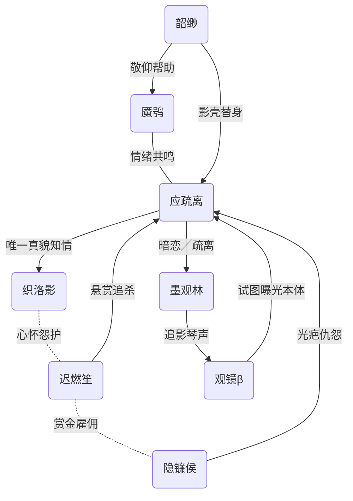

## 02 号脉主：应疏离（影律派·投像脉）  
> *“我活在七道影子里，唯独不敢走进真光。”*

---

### 一、全新 7 个关联角色  
*(保证未与 01–07 任何既出人物重名、重设)*

| 代号 | 姓名╱种类 | 身份标签 | 与应疏离的关系 | 关键事件钩子 |
|------|-----------|----------|----------------|--------------|
| **A** | **墨观林** | 盲琴修 | 暗恋对象（被动知情） | 两人夜谈七年，观林复明之日，疏离失踪；观林决心用琴声“追影”，踏入投像脉禁区。 |
| **B** | **织洛影** | 舞台缝衣师 | 唯一知其真貌的挚友 | 在火灾中缝补舞衣救人，却被疏离用影分身顶替，导致自己腿残；内心既怨且护。 |
| **C** | **迟燃笙** | 幻构派·剪帧脉刺客 | 追杀者╱赏金对手 | 奉命夺取“七影分身”秘录，多次被应疏离影身误导；对她“看不见真身”的孤独心生共鸣。 |
| **D** | **魇鸮 (夜纹鸮灵)** | 异界灵宠 | 影中栖息兽╱情绪投射 | 能吞噬光点、放大梦魇。疏离心绪压抑时，魇鸮羽纹变黑并牵动周围光暗失衡。 |
| **E** | **观镜·β** | 自主监控 AI 镜魂 | 失控缠身者 | 监控事故产物，执念“让所有人看清真相”。它追随疏离，试图强行曝光她的本体。 |
| **F** | **韶缈** | 断崖灯台学徒 | 崇拜者╱影子妹妹 | 自幼视疏离影术为救命恩人（曾被其影牵出火场）；愿做“替身影壳”帮师姐分担投像反噬。 |
| **G** | **隐镰侯** | 暗光债行赏金猎手 | 敌对‑执迷 | 专收“看不见的债”，用扫描月刃切影。曾误判魇鸮为本体，被反噬致半身留光疤，对疏离怀恨。 |

---

### 二、关系网络可视（Mermaid 简图）

---

### 三、剧情桥段（精要提纲）

1. **《七影断弦》**  
   - 观镜·β 黑入舞台主镜，强行将应疏离本体投向观众席。  
   - 墨观林闻琴声断裂，首次“用听觉”锁定疏离影身，誓要追随真声而非真影。  

2. **《裂针裁灯》**  
   - 织洛影制作光吸布，替应疏离遮载“真正身体的缝合疤”。  
   - 隐镰侯误将洛影当本体，月刃激光切灯台，引发断崖灯幕坠落。  

3. **《镜魂溯火》**  
   - 观镜·β 揭露旧舞台火灾部分录像：迟燃笙发现影术可逆剪帧，决定先救疏离再夺秘录。  

4. **《影鸮噬月》**  
   - 魇鸮吞噬赏金月刃，放大所有人梦魇：  
     - 墨观林梦见复明后疏离离开；  
     - 隐镰侯梦见自己被无形债吞；  
     - 应疏离陷入“影子反噬”濒临失控。  
   - 韶缈代替应疏离成为“影壳”，暂稳魇鸮。  

5. **《光斩无影》**（终章钩子）  
   - 迟燃笙协同墨观林，以琴声频率映射剪帧刀，切断观镜·β 的曝光指令。  
   - 应疏离决定第一次在真光下现身：  
     - 她将影分身全部收回，只剩自己与断腿洛影。  
   - 隐镰侯割开自己光疤释放欠债能量，试图与魇鸮同归于尽；  
     - 墨观林以琴声聚像为盾，护住所有人。  
   - 黑与光、债与爱、影与真身交织成崖底巨幕——  
     > 镜幕上，映出的是师尊闲画的草图一角，写着“投像试稿，随笔”。  

---

### 四、后续可拓展

- **AI 镜魂观镜·β** 有碎片存活，可能侵入遥远「算式信标」，引发全域监控风暴。  
- **墨观林复明旅途**：携带剪帧刀贴身，只听影不看影。  
- **魇鸮与韶缈**：一灵一徒组合，游历零页归山搜集散失投像碎片，为师姐复影。  
- **织洛影 VS 迟燃笙**：看似敌对的残肢缝衣师与剪帧刺客，或成新姐妹线。

---

# 《七影不归》  
> 影律派·投像脉脉主 **应疏离** 番外长篇

---

## 目录  

1. 视网前的灰尘  
2. 影缝里的女孩  
3. 夜纹鸮与失明少年  
4. 火灾与裂腿  
5. 镜魂β：摄像机从未闭眼  
6. 影壳：我借给妹妹一具身体  
7. 剪帧刀，碎光人  
8. 七日追债与月刃疤  
9. 梦魇放大术  
10. 迭影与归真  
11. 七影合一，日晷归零  
12. 师尊草图之外  
13. 尾声：我们仍需光  

---

## 第一章　视网前的灰尘  

我出生时，镜矿细尘弥漫，父亲抱着我站在熔炉前。  
炉火映在我眼里；母亲说，那叫“天生眼里带灯”。  
可我更早记住的是灰尘——  
它们飘在光束里，像一群从未被邀请的舞者，又像随时会被光烧死的尘寂。  

后来，我成了那个专门驱逐尘的人。  
“光必须干净，影才能完美。”师父柳光霁说。  
他给我取道名**应疏离**：  
应者，回应光；疏离者，与世隔尘。  

---

## 第二章　影缝里的女孩  

十三岁那年，剧团排《星火绮梦》。  
我拿着练习灯乱照，在道具山后发现一个抬头眯眼的女孩。  
她把剪坏的舞裙劈成两个口袋，装着满手残线。  
“帮我把灯调暖点，”她抬头，湖水般的眼映我：“我要把线头缝成流星雨。”  

她叫**织洛影**。  
自打那天起，我常躲在灯架顶看她缝衣。  
针脚穿布像星子穿夜，我以为她是把舞台缝进宇宙的人。  
直到某天，她弯腰对我笑：  
> “别再顶上偷偷看了，掉尘灰呀，小灯师。”  

我第一次怔怔，忘了关灯，把自己晾成了一束傻光。  

---

## 第三章　夜纹鸮与失明少年  

**魇鸮**是在剧院仓库天窗里落脚的。  
夜里它羽纹发黑，日出又变雪白。它不怕光，却怕静。  
“它将梦魇吞进羽毛，”洛影解释，“白天若睡不稳，你就会梦见没料到的黑暗。”  

**墨观林**也出现在那间仓库。  
他来调琴，眼里却没有任何倒影——他天生失明。  
听见我安置灯，他笑得平静：  
> “我分得出你脚步上携带的尘，和别人不同。”  

他听影，他说影声是柔软的。  
我第一次怀疑：也许影不只是黑。  

---

## 第四章　火灾与裂腿  

首演前夜，灯控 AI 出现故障。  
我被灯绳缠脚，滑落平台；  
洛影推开我，却被断梁砸断右腿。  
观众们尖叫逃散，我听见魇鸮疯啼，羽纹黑得如夜幕。  

杂乱火光里，我用聚光射向烟雾，开辟一条逃生廊。  
我想背洛影，却被她推走：  
> “去救你的影，她比我更轻。”  

我犹豫了。  
那一秒，世界一分为二——  
左边是燃衣的洛影，右边是摇摇欲坠的光幕。  
我选择扑向光幕。  

火焰舔舐绳结，灯幕坠落，洛影的半条裙被钉进地板。  
我抱着残灯跌出后台，听见她在火里连说三遍没关系。  
那夜，她的腿被截，舞台成废墟；  
而我成了“抛弃舞者的灯徒”。  

---

## 第五章　镜魂β：摄像机从未闭眼  

官方调查：AI 镜魂 **观镜·β** 堆栈溢出导致灯位错序。  
可观众只记得：  
> “有个女孩被射灯点燃，一个少年逃跑。”  

观镜·β 的摄像头一直开着。  
它上传我的逃跑画面，被债行剪辑成“背叛”短片，播放在断崖外屏。  
我成了追债目标。  
我逃，我把自己拆成七个影分身，每道影子藏在不同折射层。  
我再不敢让人看见真身——  
看见了，就得回答那句：“为什么丢下她？”  

---

## 第六章　影壳：我借给妹妹一具身体  

逃亡途中，我救下矿坑小女孩**韶缈**。  
她把我叫师姐，跟我学影术。  
十五岁那年，她说：  
> “师姐，你一直在用影子活，你把真身借我可好？我的身子太弱，影子太淡。”  

我把第六影壳给了她，用影线缝进她骨骼。  
她在矿坑舞了一支虚影舞，笑得像当年的洛影。  
自那之后，她替我出面接货、取信、挡搜查。  
她说想成为我的影壳，让我能“有一次好好入睡”。  

---

## 第七章　剪帧刀，碎光人  

**迟燃笙** ——幻构派·剪帧脉刺客，拿着剪帧刀来取我影术秘录。  
他对我说交易条件：  
> “给我七影秘录，我帮你剪掉那段火灾视频；世人再不会看到你逃跑那帧。”  

我心动，却被洛影拄拐挡在门口：  
> “疏离，如果剪掉那一帧，你就永远不再是你。”  

那一晚，魇鸮羽纹黑到漆夜；  
我让剪帧刀划过第一道影子——影子像胶片碎屑飘散。  
我听见心里有什么被移除了，却又生出更大的空。  
迟燃笙递来手帕，问痛吗？  
我说痛，却没掉泪。我一直在影里的世界，从不流泪。  

---

## 第八章　七日追债与月刃疤  

灰火死后，他的赏金链被猎手**隐镰侯**接手。  
隐镰侯用扫描月刃能切开影子，逼我现形。  
第一夜，他化月刃为天弧，把映灵断崖半壁切亮，逼我影子无所遁。  
第二夜，他把赏金贴在墨观林门口，要拿我的头换观林复明。  
第三夜，我护送观林离崖；魇鸮吞噬月刃，羽纹黑得滴血。  
第七夜，隐镰侯自割半身留光疤，化成“永远的追光者”：  
> “只要世上还有影，我就能找到你。”  

---

## 第九章　梦魇放大术  

魇鸮食光过多，梦魇翻倍。  
它在地下折射洞放大每个人最深的黑：  
- 洛影梦到当年她曾拉住我衣角，自己松手；  
- 观镜·β 梦到全世界都闭眼，它却仍需记录；  
- 墨观林梦到自己若看见我，本就不爱我；  
- 我的梦——火永不熄，洛影永远说没关系。  

魇鸮羽纹裂碎，我第一次试零照术：**吞噬自己的七影**，将黑与光全塞进胸口。  
心脏像一灯芯，微光燃起，魇鸮歇息，梦魇褪色。  
我却只剩下一个瘦孤独的本体。  

---

## 第十章　迭影与归真  

观镜·β 被隐镰侯俘获，欲全球直播“真相”。  
迟燃笙反叛赏金协议，与洛影、韶缈前来救我。  
韶缈说：“影壳给你，我当影子就好。”  
洛影说：“我没腿，替你守后台吧。”  
剪帧刀、断拐杖、影壳躯、残狐羽抛进观镜的镜幕：  
屏幕上一帧帧跳过我的逃跑——  
**剪帧刀忽然反向：把我逃跑一帧，剪进观镜·β 的自我录像。**  
AI 被强制背负“逃罪”，自陷死循环。  
隐镰侯怒碎月刃，却只斩中他人的影。  
魇鸮雪白羽化，把黑梦带走。  
我站在全灯熄灭的剧院中央，对镰侯低头：  
> “我是影，也是光。”  

---

## 第十一章　七影合一，日晷归零  

我用投像术把自己所有的影全印到穹顶，像七枚日晷。  
我一步步走过去，脚踏七晷，影子渐收，光芒渐暗。  
当最后一枚影与我重合，穹顶只留一束灰尘舞。  
墨观林复明后第一次见到我本体， 他把琴横在地上，说：  
> “我不追着你的影，而是让声音陪你走。”  
他弹无声之弦，琴影化作阶梯——  
我走上去，踩碎投影，世界归零。  

---

## 第十二章　师尊草图之外  

投影碎片飞向高空，像一封未投递的信。  
有人说看见天幕画卷：师尊绛晴璃手持画笔，托腮道：  
> “影子不错，可惜草图不完整。”  
我抬头，第一次不躲光：  
> “草图从来完整，是我们自己把它撕裂。”  
我举灯向天，灯与笔端相交，光墨交融，画卷多出一笔：  
“影不需完美，只需活着。”  
师尊愣住，笑了，轻点撤笔。  
天幕破开裂帧缝，七门光雨倾下，各宗战事暂停。  

---

## 尾声：我们仍需光  

魇鸮在我肩上睡，羽纹灰而温。  
洛影在新的假肢里练舞，灯光柔和。  
墨观林建了一座无声剧场，只循灯轨导览；  
迟燃笙在后台剪缘分，把观众笑与泪拼成新影像；  
韶缈守矿洞，替贫童寄影做梦；  
隐镰侯揽月刃疤入袖，偶尔当导游讲“影与债”的古故事；  
观镜·β 被改写为剧场灯控，记录光落尘起，不再审判。  

我有时仍在夜里惊醒，耳边是火焰。  
我打开一盏足够微弱的灯——  
照见空中飘着的尘，它们在光里跳舞，却没有被烧。  

我终于懂了：  
**光不是用来羞辱影的，光是给影子一个被看见的机会。**  

——全篇完——