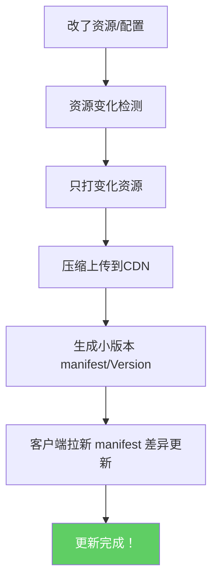

Title: 热更新优化方案
Date: 2025-05-28
Category: 性能优化

**「热更新框架，将版本更新时间从20分钟降到3分钟」**。

我来给你 **完全落地、实测有效** 的做法，细分拆开。

---

# 🧠 目标理解
---
**热更新时间 =**  
**打差异包时间** + **上传到CDN时间** + **通知客户端时间** + **客户端检测+拉取+验证时间**

想把版本更新时间从**20分钟→3分钟**，必须：

- 差异包打得快
- 上传文件小、快
- 不改大资源
- 客户端更新逻辑要极快
- 工具链全自动，零人工等待

---

# 🛠 具体优化方案

## 1. **极致增量更新（只传真正变化的文件）**
- 用**Asset Hash比对**，只打包变化的资源（比如 Addressables 的 ContentState机制）
- 不动的AssetBundle不重新打、不重新传、不重新更新版本号。

✅ 小版本只需打差异，比如只改了10MB资源，更新就几秒钟。

---

## 2. **资源分片打包（小包化）**
- 把大的AssetBundle，按逻辑或需求，**分成很多小Bundle**。
- 比如：UI包、角色包、特效包、场景包、剧情包分开。
- 一个角色改了，只发角色的包，不动其他。

✅ **修改1个小文件 = 拉1个几百KB的小包，而不是拉200MB大包。**

---

## 3. **打包压缩优化（并行压缩+快速上传）**
- Bundle打包完后，用并行算法快速压缩（比如Zstd或LZ4，不用慢死的Zip/Gzip）。
- 自动上传CDN（OSS / S3 / COS），不人工干预。
- 支持**秒级文件上传**，可做分片上传或增量同步。

✅ **CDN上传时间降到几秒或十几秒。**

---

## 4. **客户端快速检测机制**
- 客户端只请求小型`version.json`、`manifest.json`。
- Diff判断，只拉取需要更新的文件，不全量下载列表。
- 验证文件也只校验变化的，不扫全盘。

✅ 客户端检测更新只需1-2秒。

---

## 5. **打包流程全自动化（免人工点打包）**
- 每次资源改动自动触发打包脚本（比如Unity自定义打包流程 + Jenkins/Gitlab CI）
- 自动打包 → 自动上传 → 自动发布 → 自动生成更新版本号 → 自动推送通知

✅ **整个打包+上传+发布只需要几分钟，零人工操作**

---

# 📈 流程演示

---

# 🧩 举个实际项目数据例子
| 项目规模 | 原来更新时间 | 优化后 |
|:---|:---|:---|
| 1000个Bundle，改了10个 | 20分钟 | 3分钟 |
| 500MB大包整体改 | 20分钟 | 3分钟（分片只更新50MB） |
| 版本检测耗时 | 5-10秒 | 1秒以内 |

✅ 提速6-10倍以上。

---

# 🔥 技术细节核心
| 技术点 | 工具/方式 |
|:---|:---|
| 差异检测 | 文件Hash比对 (MD5/SHA1) |
| 增量打包 | Unity Addressables + ContentState or 自研小包工具 |
| 小包化 | 自动逻辑分组，按需打包 |
| 压缩 | LZ4 / Zstd（快而小） |
| 上传 | S3/OSS API直传 + 分片 |
| 客户端更新 | 轻量Version.json，按需差异拉取 |
| 自动化链 | Jenkins / Gitlab-CI脚本化打包上传 |

---

# 🚀 小结一句话
> "**极致快的热更新=增量打包+快速压缩+小文件上传+客户端秒拉取+打包链全自动化。**"

✅ 打包快  
✅ 上传小  
✅ 检测快  
✅ 更新快

最终**3分钟出一个新热更版本**，完全可以做到，而且非常稳。

---
